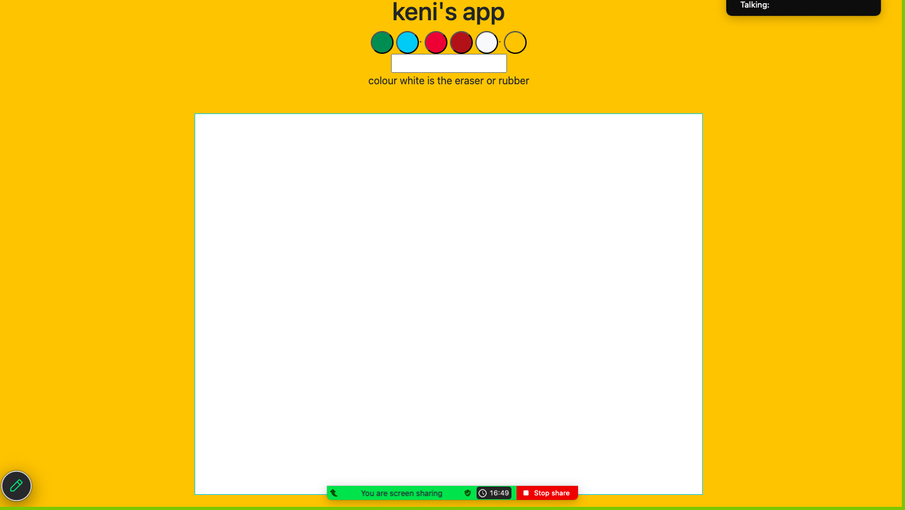
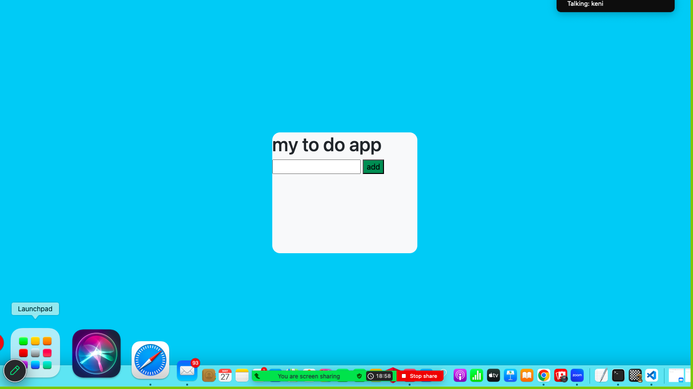
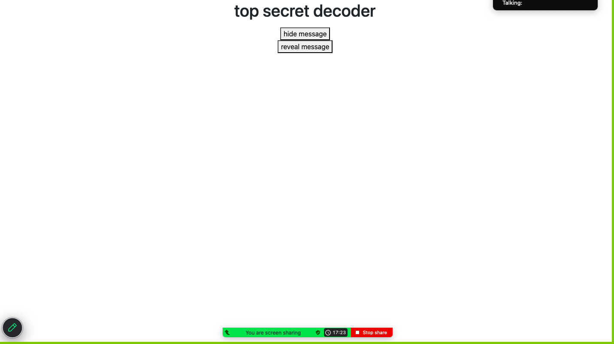
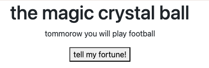

## visit my apps made using java script
[mytaskapp](https://kenijs.oneapp.dev)
[mypaintapp](https://kenipaintapp.oneapp.dev/)
[myspyapp](https://kenispyapp.oneapp.dev/)
[myfortuneapp](https://kenifortuneapp.oneapp.dev/)
<table style="width: 100%;">
  <tr>
    <td align="center">
       
      <b>Paint app made using Javascript</b>
    </td>
    <td align="center">
       
      <b>Task app made using Javascript</b>
    </td>
    <td align="center">
       
      <b>Spy app made using Javascript</b>
    </td>
    <td align="center">
       
      <b>Fortune teller app made using Javascript</b>
    </td>
  </tr>
</table>
